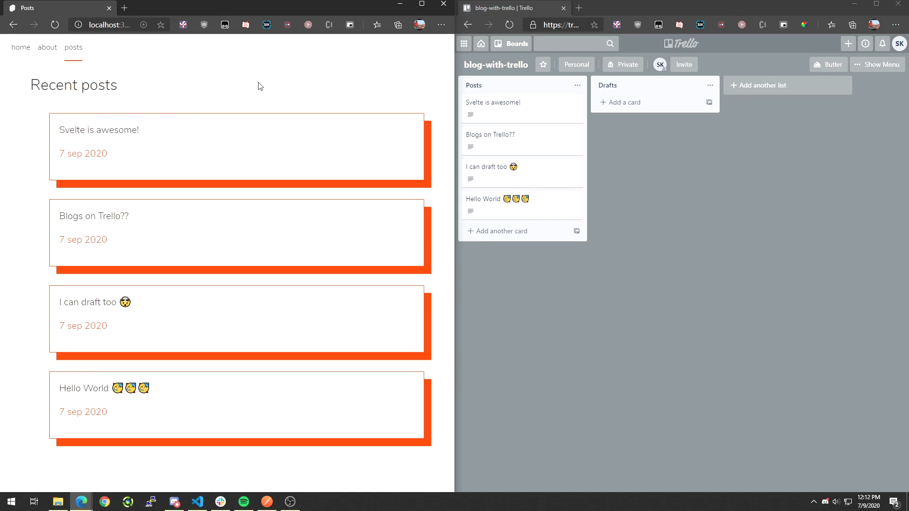

# Trello as a blog backend for Sapper JAMstack

* Clone repo.
* `npm i`
* Change .env-sample to .env with your credentials.
* `./src/routes/posts` have the trello lists as posts. 

# Furthur reading
* [DEV article](https://dev.to/shriji/sapper-jamstack-trello-as-a-blog-backend-part-1-424n) 
* The demo was hosted by [MMT Tech meetup](https://twitter.com/ileshmistry/status/1309205712942366720)